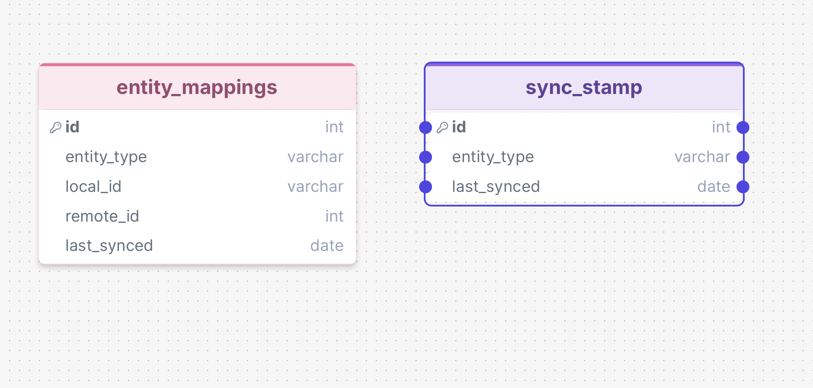

# Two-Way Sync

## Mappings

### Task mapping
**Identifier** ID (Guid) - id (Int32)  
**Description** Contents (String) vs subject (String) + body (String)  
**Due date** Deadline (UTC datetime) vs deadline (datetime in Swedish time)  
**Completion status** Completed (Boolean) vs finished (Boolean)  
**Completion time** CompletedDate (UTC datetime) vs N/A  
**Company relation** CompanyId (Guid) vs related_company_id (Int32)  
**Changes** ChangedDate (UTC datetime) vs last_modified_date (datetime in Swedish time)  

### Company mapping
**Identifier** - ID (Guid) vs id (Int32)  
**Company name** Name (String) vs name (string)  
**Changes** ChangedDate (UTC datetime) vs last_modified_date (datetime in Swedish time)  

### EntityMappings
**entity_type** (string) // This could be either Task or Company  
**local_id** (guid) //  
**remote_id** (int) //  
**last_synced** (DateTime)  

### Sync Stamp
**entity_type** (varchar)  
**last_synced_date** (DateTime)

### To do

* Create core models (match fields per API and data definitions)
* Add a time zone converter
* Prepare postgres schema for the database
* Implement the Membrain Internal API
* Implement the Remote System External API
* Create the core system, i.e. SyncEngine
    * This needs to sync company renaming, local and remote tasks and keep track of updates

**Needed:**
- Something to keep track of changes, SyncStamp or something

### SQL Tables

